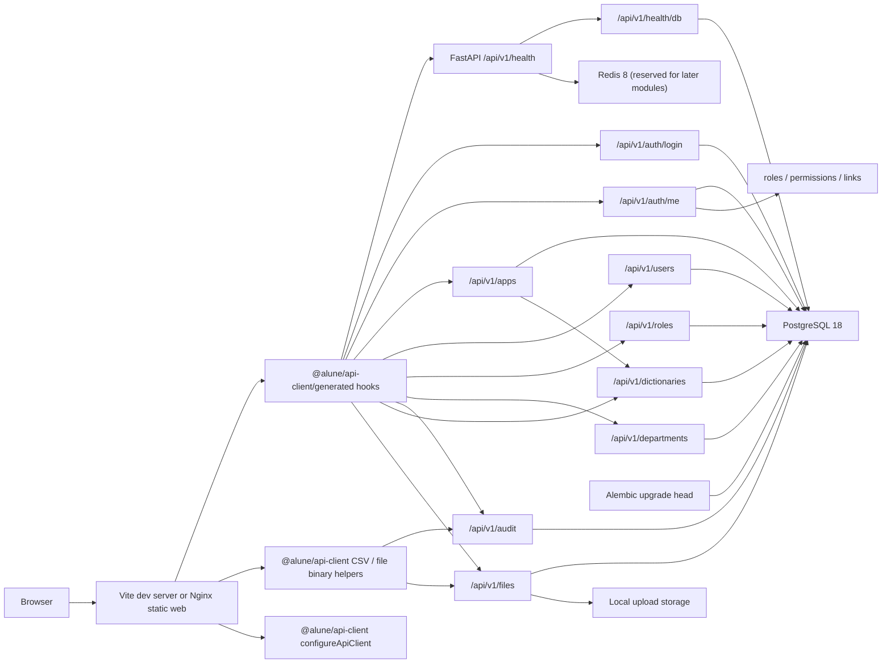

# Architecture

`alune-platform` is the Alune Hub personal platform foundation. The current implementation includes the stage 6G-W security/deployment hardening baseline, stage 6H user-facing repositioning to a personal workspace, and stage 7A App Center V1. The platform provides authentication, RBAC, collaborator/user management, spaces, operation logs, configuration dictionaries, file resources, and app entry registration/navigation. App Center V1 is a registry and launcher for internal pages and external links; it does not execute scripts, load dynamic plugins, or schedule jobs.

## Monorepo Layout

```text
alune-platform/
├── apps/
│   ├── api/          # FastAPI backend
│   └── web/          # Vite React frontend
├── packages/
│   ├── api-client/   # Compatibility client plus Orval-generated API client
│   ├── eslint-config/
│   ├── shared/
│   └── tsconfig/
├── infra/
│   ├── docker/
│   ├── nginx/
│   └── postgres/
├── docker-compose.yml
├── pnpm-workspace.yaml
└── turbo.json
```

## Backend

Backend entrypoint: `apps/api/app/main.py`.

FastAPI creates one app with:

- CORS from `Settings.api_cors_origins`.
- Global exception handler registration.
- Health router mounted at `/api/v1/health`.
- Lifespan cleanup that disposes the async SQLAlchemy engine.

Important modules:

- `app/core/config.py` reads environment variables with `pydantic-settings`. An `ENVIRONMENT` setting (development/staging/production) controls runtime behavior; in production, default values for `JWT_SECRET_KEY`, `POSTGRES_PASSWORD`/the PostgreSQL password embedded in `DATABASE_URL`, and `MINIO_SECRET_KEY` are rejected, and `JWT_SECRET_KEY` requires at least 32 characters.
- `app/db/session.py` creates an async SQLAlchemy engine with `asyncpg`.
- `app/db/base.py` defines SQLAlchemy declarative metadata for Alembic.
- `app/common/response.py` defines the generic `ApiResponse[DataT]` envelope, and `app/common/pagination.py` defines paginated list payloads.
- `app/modules/health/router.py` implements API and database health checks.
- `app/modules/system/models.py` defines the `system_info` table model.
- `app/modules/auth/` implements the login MVP: `users` model, password hashing, JWT creation, current-user dependency, and auth router.
- `app/modules/permissions/` implements the RBAC baseline: roles, permissions, association tables, default permission registry, permission queries, and `require_permission`.
- `app/modules/apps/` implements retained App Center entries under `/api/v1/apps`, backed by `platform_apps` and `app_category` dictionary values. It is no longer the primary RAG navigation path.
- `app/modules/knowledge/` implements knowledge bases, document indexing, pgvector chunk storage, OpenAI-compatible RAG question answering, and citation responses.
- `app/modules/users/`, `app/modules/roles/`, and `app/modules/departments/` implement user creation/update/password reset, batch user status updates, user role assignment, user filtering by role/space, role create/update/delete guards, role permission assignment, space trees, and space edit/delete rules. The retained technical module name is `departments`.
- `app/modules/audit/`, `app/modules/dictionaries/`, and `app/modules/files/` implement paginated log reads with date filters and CSV export, dictionary type/item maintenance with system/delete guards, and local/MinIO file upload/download metadata with upload policy checks, a file storage backend factory, and an optional ClamAV upload scanner.
- `alembic/` contains migration environment and versioned schema changes.

## Frontend

Frontend entrypoint: `apps/web/src/app/main.tsx`.

The app uses:

- TanStack Router in `src/app/router.tsx` and `src/routes/`.
- TanStack Query via `src/lib/query-client.ts`.
- Zustand only for UI state in `src/stores/ui-store.ts`.
- shadcn/ui-compatible primitives in `src/components/ui/`.
- App shell layout in `src/components/layout/`.
- Home page in `src/features/dashboard/dashboard-page.tsx`.
- Login page and auth provider in `src/features/auth/`.
- Apps, users, roles, spaces, audit logs, configuration dictionaries, and file resources pages in `src/features/`; apps include app entry registration/navigation, users include role/space filters plus confirmed batch status controls with result feedback, roles include guarded create/edit/delete controls plus searchable grouped permissions with empty-state feedback, audit includes date filters and CSV export, and dictionaries include type/item maintenance controls.
- Frontend interaction tests cover app center creation/status changes, user batch status, role permission search, dictionary type creation, space tree/create flow, audit export filters, and file upload.
- Playwright smoke tests in `apps/web/e2e/` cover protected-route redirect, seeded-admin login, and Alune Hub navigation.
- Navigation permission filtering in `src/config/navigation.ts`.

The home health check, auth entry points, platform read queries, and user/role/space/dictionary JSON write actions now use Orval-generated React Query hooks from `@alune/api-client/generated`. The `@alune/api-client` root export is now intentionally narrow: runtime configuration, audit CSV export, file upload, file download, and the few types needed by those compatibility boundaries.

Stage 6G-E adds a reproducible generation path:

- `apps/api/app/scripts/export_openapi.py` exports FastAPI OpenAPI to `packages/api-client/openapi/openapi.json`.
- The export script normalizes Pydantic v2 multipart binary schemas from `contentMediaType: application/octet-stream` to OpenAPI `format: binary`, so Orval generates upload fields as `Blob`.
- `packages/api-client/orval.config.ts` reads that local schema and writes `packages/api-client/src/generated/api.ts`.
- `packages/api-client/src/runtime-config.ts` stores the API base URL. Its default is same-origin relative requests; `apps/web/src/app/main.tsx` can override it from `VITE_API_BASE_URL` for local Vite development.
- `packages/api-client/src/orval-fetch.ts` is the generated client's custom fetcher. It uses the runtime API base URL and returns Orval's `{ data, status, headers }` response shape.
- `packages/api-client/src/index.ts` remains a narrow compatibility layer for runtime configuration, audit CSV export, file upload, and file download. It no longer exports the migrated JSON read/write helpers; frontend code should import generated hooks and types from `@alune/api-client/generated` for normal API access.
- Docker Web uses `infra/nginx/web.conf` to serve the SPA and proxy `/api/` to the API container, so production browsers do not call `localhost:8000`.

## CI

GitHub Actions workflow: `.github/workflows/ci.yml`.

- `quality` runs on push and pull request. It sets up Node.js 24, pnpm 10.26.1, Python 3.14, and uv, then verifies API client generation drift, lint, typecheck, tests, build, and Docker Compose config.
- `playwright-smoke` is manual through `workflow_dispatch` with `run_playwright_smoke=true`. It starts PostgreSQL/Redis, applies migrations, seeds `e2e_admin`, starts the API, and runs `apps/web/e2e/admin-smoke.spec.ts`.

## Dependency Updates

Dependabot configuration: `.github/dependabot.yml`.

- `npm` at `/` watches the pnpm workspace manifests and lockfile.
- `uv` at `/apps/api` watches backend Python dependencies.
- `docker` at `/infra/docker` watches API/Web Dockerfiles.
- `docker-compose` at `/` watches service image tags in `docker-compose.yml`.
- `github-actions` at `/` watches workflow action references.

Each ecosystem runs weekly on Monday morning in `Asia/Shanghai` and groups all updates for that ecosystem into a single pull request.

## Security Audit

Manual dependency audit entrypoints:

- `pnpm security:audit` runs both Node.js and Python dependency audits.
- `pnpm security:audit:npm` runs `pnpm audit --audit-level moderate`.
- `pnpm security:audit:python` runs `scripts/security-audit-python.sh`, which exports the backend uv lockfile to a temporary requirements file and scans it with `uvx pip-audit`.

These commands are intentionally not part of the default CI job yet.

## Feature Readiness

The current readiness decision is documented in `docs/feature-readiness.md`: the security audit gate is resolved, stage 6H repositions the product as Alune Hub, and stage 7A adds App Center V1 as the first personal-platform module. Future modules should continue to start from a written scope brief and follow existing patterns for Alembic migrations, generated API client usage, permissions, audit logs, and tests.

## Runtime Data Flow



## Docker Topology

Default Compose services:

- `postgres`: PostgreSQL 18 on host port `5432`.
- `redis`: Redis 8 on host port `6379`.

`app` profile services:

- `api`: FastAPI image built from `infra/docker/api.Dockerfile`, exposed on host port `8000` by default.
- `web`: Nginx static image built from `infra/docker/web.Dockerfile`, exposed on host port `5173` by default.

PostgreSQL 18 stores data under a major-version-specific cluster directory. The Compose volume is mounted at `/var/lib/postgresql` to match the official image layout.

The `api` service stores uploaded file binaries under `/app/uploads`, backed by the named Compose volume `api_uploads`, when `FILE_STORAGE_BACKEND=local`. Local development defaults to `.local/uploads` through `LOCAL_FILE_STORAGE_DIR`. Uploads are limited by `MAX_UPLOAD_SIZE_BYTES` and `ALLOWED_UPLOAD_CONTENT_TYPES`. `FILE_STORAGE_BACKEND=minio` uses the MinIO SDK with `MINIO_ENDPOINT`, `MINIO_ACCESS_KEY`, `MINIO_SECRET_KEY`, `MINIO_BUCKET`, and `MINIO_SECURE`; the optional Compose `minio` profile starts MinIO and creates the configured bucket through the one-shot `minio-init` service. `UPLOAD_SCANNER_ENABLED=true` with `UPLOAD_SCANNER_BACKEND=clamav` scans uploads through clamd's `INSTREAM` protocol using `CLAMAV_HOST`, `CLAMAV_PORT`, and `CLAMAV_TIMEOUT_SECONDS`; the optional Compose `clamav` profile starts a local ClamAV service.

## Current API Surface

The FastAPI root path `/` is intentionally not part of the API surface. Use `/docs`, `/openapi.json`, or the versioned `/api/v1/...` routes below.

| Method | Path                                            | Purpose                                                                                            |
| ------ | ----------------------------------------------- | -------------------------------------------------------------------------------------------------- |
| GET    | `/api/v1/health`                                | Confirm API process is alive.                                                                      |
| GET    | `/api/v1/health/db`                             | Run `SELECT 1` through SQLAlchemy AsyncSession. Returns 503 if PostgreSQL is unavailable.          |
| POST   | `/api/v1/auth/login`                            | OAuth2 password login. Returns a JWT access token.                                                 |
| GET    | `/api/v1/auth/me`                               | Returns the current active user and permission codes from a Bearer token.                          |
| GET    | `/api/v1/apps`                                  | Returns paginated App Center entries with search/category/status filters.                          |
| POST   | `/api/v1/apps`                                  | Creates an App Center entry.                                                                       |
| PATCH  | `/api/v1/apps/{app_id}`                         | Updates an App Center entry.                                                                       |
| PATCH  | `/api/v1/apps/{app_id}/status`                  | Enables or disables an App Center entry.                                                           |
| GET    | `/api/v1/knowledge-bases`                       | Returns paginated RAG knowledge bases.                                                             |
| POST   | `/api/v1/knowledge-bases`                       | Creates a knowledge base and owner member.                                                         |
| PATCH  | `/api/v1/knowledge-bases/{id}`                  | Updates knowledge base metadata.                                                                   |
| DELETE | `/api/v1/knowledge-bases/{id}`                  | Disables a knowledge base.                                                                         |
| GET    | `/api/v1/knowledge-bases/{id}/members`          | Returns owner-managed knowledge base members.                                                      |
| PUT    | `/api/v1/knowledge-bases/{id}/members`          | Replaces knowledge base members.                                                                   |
| GET    | `/api/v1/knowledge-bases/{id}/documents`        | Returns documents in a knowledge base.                                                             |
| POST   | `/api/v1/knowledge-bases/{id}/documents/upload` | Uploads, parses, chunks, embeds, and indexes a document.                                           |
| GET    | `/api/v1/knowledge-documents/{id}`              | Returns one knowledge document.                                                                    |
| POST   | `/api/v1/knowledge-documents/{id}/index`        | Re-indexes a stored knowledge document.                                                            |
| DELETE | `/api/v1/knowledge-documents/{id}`              | Marks a knowledge document deleted/failed.                                                         |
| POST   | `/api/v1/rag/ask`                               | Runs single-turn RAG over selected knowledge bases and returns citations.                          |
| GET    | `/api/v1/users`                                 | Returns paginated user records for administrators. Supports `q`, `department_id`, and `role_code`. |
| POST   | `/api/v1/users`                                 | Creates a user account.                                                                            |
| PATCH  | `/api/v1/users/bulk-status`                     | Enables or disables multiple users and records one audit log entry.                                |
| PATCH  | `/api/v1/users/{user_id}`                       | Updates user account state.                                                                        |
| PATCH  | `/api/v1/users/{user_id}/password`              | Resets a user password.                                                                            |
| GET    | `/api/v1/users/{user_id}/roles`                 | Returns role codes assigned to one user.                                                           |
| PUT    | `/api/v1/users/{user_id}/roles`                 | Replaces role codes assigned to one user.                                                          |
| GET    | `/api/v1/roles`                                 | Returns role records for administrators.                                                           |
| POST   | `/api/v1/roles`                                 | Creates non-system role records.                                                                   |
| GET    | `/api/v1/roles/permissions`                     | Returns all permission records.                                                                    |
| GET    | `/api/v1/roles/{role_id}/permissions`           | Returns permission codes assigned to one role.                                                     |
| PATCH  | `/api/v1/roles/{role_id}`                       | Updates non-system roles.                                                                          |
| DELETE | `/api/v1/roles/{role_id}`                       | Deletes non-system roles only when no users are assigned.                                          |
| PUT    | `/api/v1/roles/{role_id}/permissions`           | Replaces permission codes assigned to one role.                                                    |
| GET    | `/api/v1/departments`                           | Returns paginated space records; technical path remains `departments`.                             |
| GET    | `/api/v1/departments/tree`                      | Returns a nested space tree; technical path remains `departments`.                                 |
| POST   | `/api/v1/departments`                           | Creates a space record; technical path remains `departments`.                                      |
| PATCH  | `/api/v1/departments/{department_id}`           | Updates space fields; technical path remains `departments`.                                        |
| DELETE | `/api/v1/departments/{department_id}`           | Deletes spaces only when no child spaces or users are assigned.                                    |
| GET    | `/api/v1/audit/operation-logs`                  | Returns paginated/filterable operation logs with optional date range.                              |
| GET    | `/api/v1/audit/operation-logs/export`           | Exports operation logs as CSV with `q`, `status`, `started_at`, and `ended_at` filters.            |
| GET    | `/api/v1/audit/login-logs`                      | Returns paginated/filterable login logs with optional date range.                                  |
| GET    | `/api/v1/audit/login-logs/export`               | Exports login logs as CSV with `q`, `status`, `started_at`, and `ended_at` filters.                |
| GET    | `/api/v1/dictionaries/types`                    | Returns dictionary types.                                                                          |
| POST   | `/api/v1/dictionaries/types`                    | Creates a dictionary type.                                                                         |
| PATCH  | `/api/v1/dictionaries/types/{type_id}`          | Updates non-system dictionary types.                                                               |
| DELETE | `/api/v1/dictionaries/types/{type_id}`          | Deletes non-system dictionary types only when no items exist.                                      |
| GET    | `/api/v1/dictionaries/items`                    | Returns dictionary items.                                                                          |
| POST   | `/api/v1/dictionaries/items`                    | Creates a dictionary item.                                                                         |
| PATCH  | `/api/v1/dictionaries/items/{item_id}`          | Updates or enables/disables a dictionary item.                                                     |
| DELETE | `/api/v1/dictionaries/items/{item_id}`          | Deletes a dictionary item.                                                                         |
| GET    | `/api/v1/files`                                 | Returns paginated file attachment metadata.                                                        |
| POST   | `/api/v1/files`                                 | Creates file attachment metadata.                                                                  |
| POST   | `/api/v1/files/upload`                          | Uploads local file content and creates attachment metadata.                                        |
| GET    | `/api/v1/files/{file_id}/download`              | Downloads stored file content.                                                                     |

## Current Database Schema

| Table                                   | Purpose                                                                     |
| --------------------------------------- | --------------------------------------------------------------------------- |
| `system_info`                           | Minimal baseline table for system metadata and migration verification.      |
| `users`                                 | Login MVP user account table with password hash and active/superuser flags. |
| `roles`                                 | RBAC role definitions.                                                      |
| `permissions`                           | Menu and action permission definitions.                                     |
| `user_roles`                            | User-to-role assignments.                                                   |
| `role_permissions`                      | Role-to-permission assignments.                                             |
| `departments`                           | Space hierarchy and user assignment target; technical table name retained.  |
| `platform_apps`                         | Alune Hub App Center entries for internal pages and external links.         |
| `knowledge_bases`                       | RAG knowledge base metadata and active state.                               |
| `knowledge_base_members`                | Per-knowledge-base owner/editor/viewer access.                              |
| `knowledge_documents`                   | Uploaded knowledge documents and parse/index status.                        |
| `knowledge_chunks`                      | Text chunks, metadata, hashes, and pgvector embeddings for retrieval.       |
| `operation_logs`                        | Operation log foundation.                                                   |
| `login_logs`                            | Login log foundation.                                                       |
| `dictionary_types` / `dictionary_items` | Configuration dictionary foundation.                                        |
| `file_attachments`                      | File attachment metadata foundation.                                        |

## Not Implemented Yet

- Script execution, dynamic plugin loading, schedulers, approvals, reports, and company-specific enterprise workflows.
- External TLS/domain termination in front of the Docker Web proxy.
