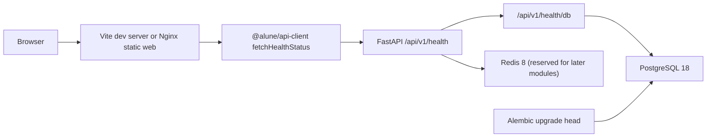

# Architecture

`alune-platform` is a minimal monorepo foundation for a company internal admin platform. The current implementation intentionally stops at the stage 0-3 MVP: infrastructure, health checks, a dashboard shell, and the first Alembic-managed database table.

## Monorepo Layout

```text
alune-platform/
├── apps/
│   ├── api/          # FastAPI backend
│   └── web/          # Vite React frontend
├── packages/
│   ├── api-client/   # Temporary API client; Orval target later
│   ├── eslint-config/
│   ├── shared/
│   └── tsconfig/
├── infra/
│   ├── docker/
│   ├── nginx/
│   └── postgres/
├── docker-compose.yml
├── pnpm-workspace.yaml
└── turbo.json
```

## Backend

Backend entrypoint: `apps/api/app/main.py`.

FastAPI creates one app with:

- CORS from `Settings.api_cors_origins`.
- Global exception handler registration.
- Health router mounted at `/api/v1/health`.
- Lifespan cleanup that disposes the async SQLAlchemy engine.

Important modules:

- `app/core/config.py` reads environment variables with `pydantic-settings`.
- `app/db/session.py` creates an async SQLAlchemy engine with `asyncpg`.
- `app/db/base.py` defines SQLAlchemy declarative metadata for Alembic.
- `app/common/response.py` defines the generic `ApiResponse[DataT]` envelope.
- `app/modules/health/router.py` implements API and database health checks.
- `app/modules/system/models.py` defines the `system_info` table model.
- `alembic/` contains migration environment and versioned schema changes.

## Frontend

Frontend entrypoint: `apps/web/src/app/main.tsx`.

The app uses:

- TanStack Router in `src/app/router.tsx` and `src/routes/`.
- TanStack Query via `src/lib/query-client.ts`.
- Zustand only for UI state in `src/stores/ui-store.ts`.
- shadcn/ui-compatible primitives in `src/components/ui/`.
- App shell layout in `src/components/layout/`.
- Dashboard page in `src/features/dashboard/dashboard-page.tsx`.

The dashboard calls `fetchHealthStatus` from `@alune/api-client`. That package is still hand-written for the MVP and has a TODO to replace it with Orval-generated output from FastAPI `/openapi.json`.

## Runtime Data Flow



## Docker Topology

Default Compose services:

- `postgres`: PostgreSQL 18 on host port `5432`.
- `redis`: Redis 8 on host port `6379`.

`app` profile services:

- `api`: FastAPI image built from `infra/docker/api.Dockerfile`, exposed on host port `8000` by default.
- `web`: Nginx static image built from `infra/docker/web.Dockerfile`, exposed on host port `5173` by default.

PostgreSQL 18 stores data under a major-version-specific cluster directory. The Compose volume is mounted at `/var/lib/postgresql` to match the official image layout.

## Current API Surface

| Method | Path | Purpose |
| --- | --- | --- |
| GET | `/api/v1/health` | Confirm API process is alive. |
| GET | `/api/v1/health/db` | Run `SELECT 1` through SQLAlchemy AsyncSession. Returns 503 if PostgreSQL is unavailable. |

## Current Database Schema

| Table | Purpose |
| --- | --- |
| `system_info` | Minimal baseline table for system metadata and migration verification. |

## Not Implemented Yet

- Login and JWT issuance endpoints.
- Users, roles, permissions, departments, approvals, reports, file attachments.
- Production reverse proxy or deployment topology.
