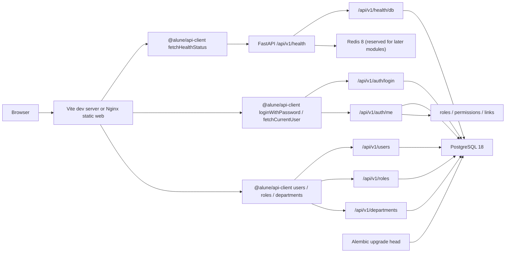

# Architecture

`alune-platform` is a minimal monorepo foundation for a company internal admin platform. The current implementation stops at the stage 6B MVP: infrastructure, health checks, a dashboard shell, Alembic-managed tables, a narrow login flow, the first RBAC baseline, and internal system pages for users, roles, departments, audit logs, dictionaries, and file metadata.

## Monorepo Layout

```text
alune-platform/
├── apps/
│   ├── api/          # FastAPI backend
│   └── web/          # Vite React frontend
├── packages/
│   ├── api-client/   # Temporary API client; Orval target later
│   ├── eslint-config/
│   ├── shared/
│   └── tsconfig/
├── infra/
│   ├── docker/
│   ├── nginx/
│   └── postgres/
├── docker-compose.yml
├── pnpm-workspace.yaml
└── turbo.json
```

## Backend

Backend entrypoint: `apps/api/app/main.py`.

FastAPI creates one app with:

- CORS from `Settings.api_cors_origins`.
- Global exception handler registration.
- Health router mounted at `/api/v1/health`.
- Lifespan cleanup that disposes the async SQLAlchemy engine.

Important modules:

- `app/core/config.py` reads environment variables with `pydantic-settings`.
- `app/db/session.py` creates an async SQLAlchemy engine with `asyncpg`.
- `app/db/base.py` defines SQLAlchemy declarative metadata for Alembic.
- `app/common/response.py` defines the generic `ApiResponse[DataT]` envelope.
- `app/modules/health/router.py` implements API and database health checks.
- `app/modules/system/models.py` defines the `system_info` table model.
- `app/modules/auth/` implements the login MVP: `users` model, password hashing, JWT creation, current-user dependency, and auth router.
- `app/modules/permissions/` implements the RBAC baseline: roles, permissions, association tables, default permission registry, permission queries, and `require_permission`.
- `app/modules/users/`, `app/modules/roles/`, and `app/modules/departments/` implement user creation/update, role permission assignment, and department edit/delete rules.
- `app/modules/audit/`, `app/modules/dictionaries/`, and `app/modules/files/` implement log reads, dictionary type/item creation, and file attachment metadata.
- `alembic/` contains migration environment and versioned schema changes.

## Frontend

Frontend entrypoint: `apps/web/src/app/main.tsx`.

The app uses:

- TanStack Router in `src/app/router.tsx` and `src/routes/`.
- TanStack Query via `src/lib/query-client.ts`.
- Zustand only for UI state in `src/stores/ui-store.ts`.
- shadcn/ui-compatible primitives in `src/components/ui/`.
- App shell layout in `src/components/layout/`.
- Dashboard page in `src/features/dashboard/dashboard-page.tsx`.
- Login page and auth provider in `src/features/auth/`.
- Users, roles, departments, audit, dictionaries, and files pages in `src/features/`.
- Navigation permission filtering in `src/config/navigation.ts`.

The dashboard, login flow, and internal system pages call `@alune/api-client`. That package is still hand-written for the MVP and has a TODO to replace it with Orval-generated output from FastAPI `/openapi.json`.

## Runtime Data Flow



## Docker Topology

Default Compose services:

- `postgres`: PostgreSQL 18 on host port `5432`.
- `redis`: Redis 8 on host port `6379`.

`app` profile services:

- `api`: FastAPI image built from `infra/docker/api.Dockerfile`, exposed on host port `8000` by default.
- `web`: Nginx static image built from `infra/docker/web.Dockerfile`, exposed on host port `5173` by default.

PostgreSQL 18 stores data under a major-version-specific cluster directory. The Compose volume is mounted at `/var/lib/postgresql` to match the official image layout.

## Current API Surface

| Method | Path | Purpose |
| --- | --- | --- |
| GET | `/api/v1/health` | Confirm API process is alive. |
| GET | `/api/v1/health/db` | Run `SELECT 1` through SQLAlchemy AsyncSession. Returns 503 if PostgreSQL is unavailable. |
| POST | `/api/v1/auth/login` | OAuth2 password login. Returns a JWT access token. |
| GET | `/api/v1/auth/me` | Returns the current active user and permission codes from a Bearer token. |
| GET | `/api/v1/users` | Returns user records for administrators. |
| POST | `/api/v1/users` | Creates a user account. |
| PATCH | `/api/v1/users/{user_id}` | Updates user account state. |
| GET | `/api/v1/roles` | Returns role records for administrators. |
| GET | `/api/v1/roles/permissions` | Returns all permission records. |
| GET | `/api/v1/roles/{role_id}/permissions` | Returns permission codes assigned to one role. |
| PUT | `/api/v1/roles/{role_id}/permissions` | Replaces permission codes assigned to one role. |
| GET | `/api/v1/departments` | Returns department records for administrators. |
| POST | `/api/v1/departments` | Creates a department record. |
| PATCH | `/api/v1/departments/{department_id}` | Updates department fields. |
| DELETE | `/api/v1/departments/{department_id}` | Deletes departments only when no children or users are assigned. |
| GET | `/api/v1/audit/operation-logs` | Returns operation logs. |
| GET | `/api/v1/audit/login-logs` | Returns login logs. |
| GET | `/api/v1/dictionaries/types` | Returns dictionary types. |
| POST | `/api/v1/dictionaries/types` | Creates a dictionary type. |
| GET | `/api/v1/dictionaries/items` | Returns dictionary items. |
| POST | `/api/v1/dictionaries/items` | Creates a dictionary item. |
| GET | `/api/v1/files` | Returns file attachment metadata. |
| POST | `/api/v1/files` | Creates file attachment metadata. |

## Current Database Schema

| Table | Purpose |
| --- | --- |
| `system_info` | Minimal baseline table for system metadata and migration verification. |
| `users` | Login MVP user account table with password hash and active/superuser flags. |
| `roles` | RBAC role definitions. |
| `permissions` | Menu and action permission definitions. |
| `user_roles` | User-to-role assignments. |
| `role_permissions` | Role-to-permission assignments. |
| `departments` | Department hierarchy and user assignment target. |
| `operation_logs` | Operation log foundation. |
| `login_logs` | Login log foundation. |
| `dictionary_types` / `dictionary_items` | Dictionary management foundation. |
| `file_attachments` | File attachment metadata foundation. |

## Not Implemented Yet

- File binary upload/download flow, complex organization workflows, approvals, reports, and company-specific business modules.
- Production reverse proxy or deployment topology.
